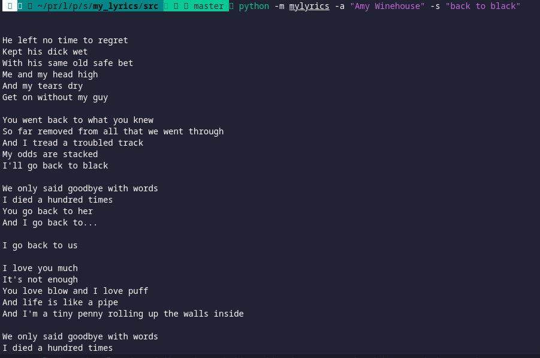

## Web Scraping with Python



* In the repo, I created a cmd app for scraping lyrics from [A-Z lyrics](https://azlyrics.com).
* The app uses BeautifulSoup and requests libraries to scrape the lyrics.
* The user can input the song name and artist name to get the lyrics.

* You will need to create a virtual environment first.

```bash
python -m virtualenv env
```

* Then activate the environment.
```bash
source env/bin/activate
```

* Then install the requirements from the reuirements.txt file.
```bash
pip install -r requirements.tex
```

* Then cd into the src folder and run the mylyrics as a module.
```bash
python -m mylyrics -a "Amy Winehouse" -s "Back to Black"
```